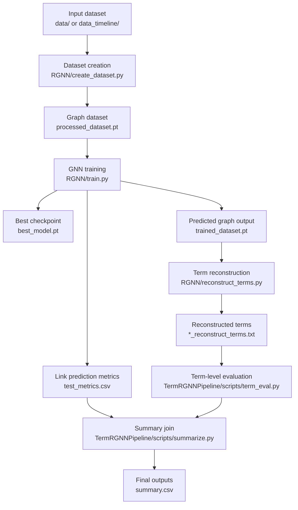
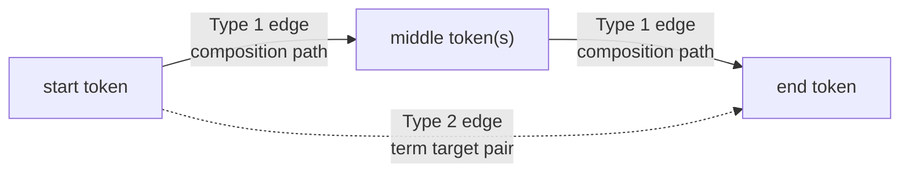
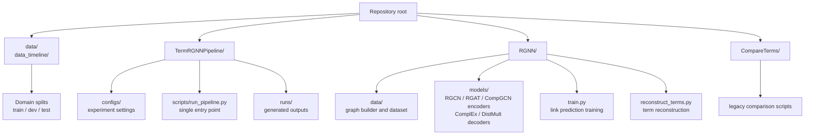
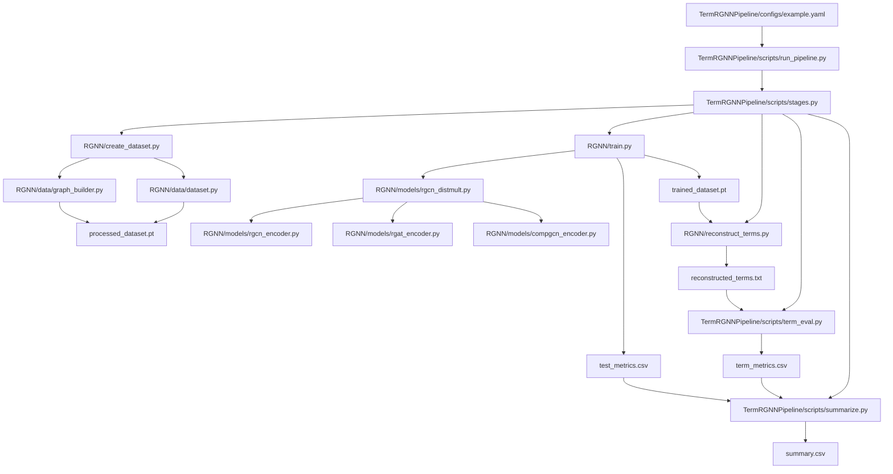
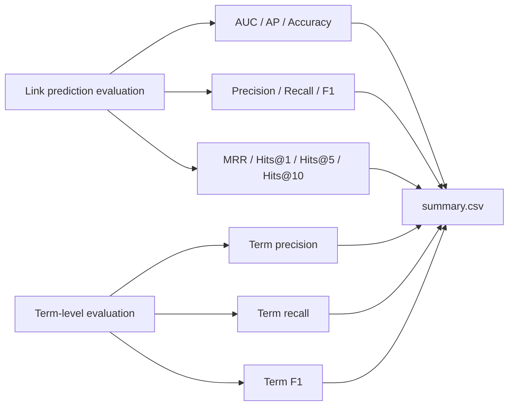

# Term RGNN Project

このリポジトリは、用語データセットから Type 1 / Type 2 edge を持つグラフを作成し、RGNN / CompGCN による link prediction と、復元された term-level evaluation をまとめて実行するためのプロジェクトです。

## Overall Workflow



## Edge Types



| Project label | Internal id | Role |
| --- | ---: | --- |
| Type 1 | 0 | 単語列をどうつなぐかを表す composition edge |
| Type 2 | 1 | 始点から終点までを term として復元したい対象ペア |

## Main Directories



## File Relationship



## How To Run

ルートディレクトリから実行します。

```powershell
.\.venv\Scripts\python.exe .\TermRGNNPipeline\scripts\run_pipeline.py `
  --config .\TermRGNNPipeline\configs\example.yaml
```

CompGCN encoder を使う場合は、次の config を使います。

```powershell
.\.venv\Scripts\python.exe .\TermRGNNPipeline\scripts\run_pipeline.py `
  --config .\TermRGNNPipeline\configs\compgcn_example.yaml
```

## Evaluation Outputs



最終的な評価結果は `TermRGNNPipeline/runs/{run_name}/summary/summary.csv` にまとめられます。

## References

- `TermRGNNPipeline/README.md`: pipeline の実行方法、config、出力構造
- `RGNN/README.md`: GNN 内部処理、edge type、negative sampling、ranking evaluation
- `.gitignore`: commit から除外する中間生成物、学習済みモデル、キャッシュ類
